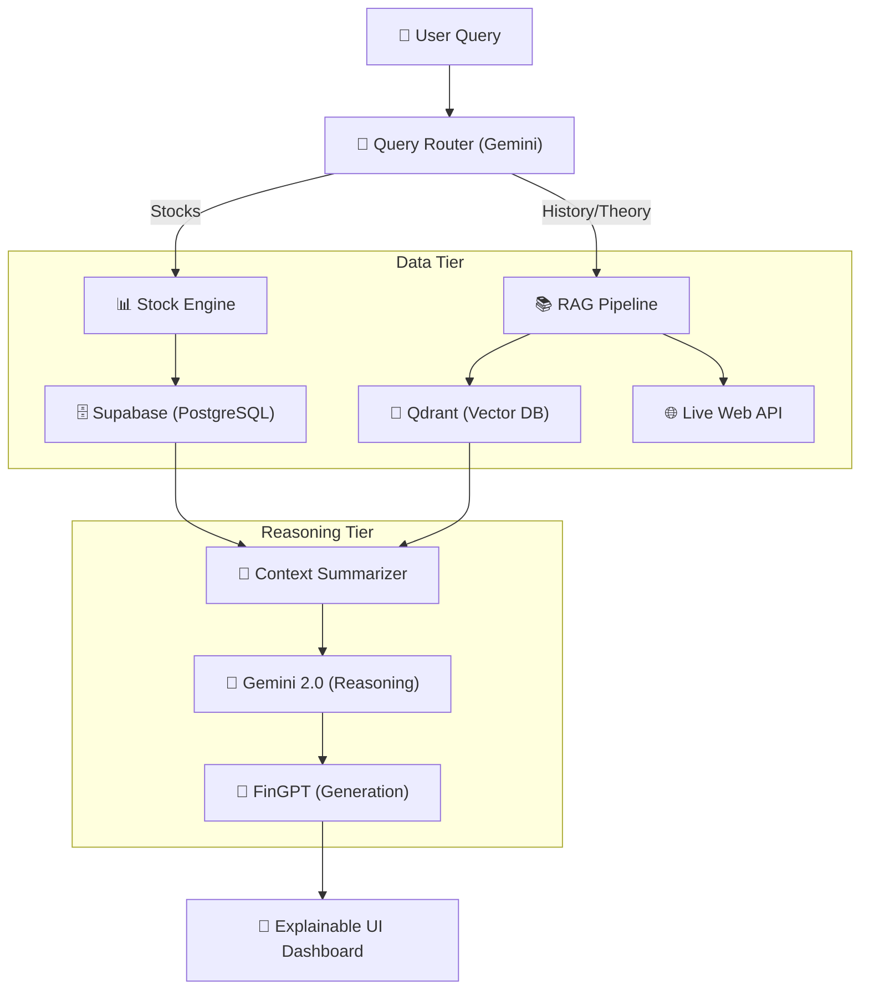

# 🏛️ FINTEX – Financial Research Agent & Data Pipeline
> **A State-of-the-Art hybrid AI agent for Pakistan's economy & markets.**

---

## 🚀 Overview

**Fintex** is a highly specialized, dual-model financial research pipeline designed to bridge the gap between "Generative AI" and "Hard Market Facts." It automates the retrieval of economic data, analyzes it through a financial lens, and presents it via a multi-layered, **Explainable UI**.

Built for the Pakistan Stock Exchange (PSX) and macroeconomic enthusiasts, it ensures that every AI response is **Grounded, Verifiable, and Interactive.**

---

## 🏗️ The Architecture

Fintex uses an orchestration layer that separates **Intention** (reasoning) from **Information** (retrieval).

---

## 💎 Key Features

### 1. Section 7 — Advanced Stock Dashboard
Instead of simple text, stock queries trigger a data-rich interactive dashboard.
*   **Vertical-Stacked Charts:** Integrated **Recharts** for Price, High/Low Bands, Volume, and % Change.
*   **Company Context:** Metadata cards for major tickers (Engro, HBL, FFBL) with sector tagging.
*   **Timeframe Control:** Dynamic queries from 1-Week to 5-Year ranges.

### 2. Section 6 — Accuracy Transparency System
Every response comes with an **Accuracy Badge** that evaluates the reliability of the answer.
*   **Confidence Scoring:** 88%–98% for multi-source verified data; 60%–75% for AI-only logical extensions.
*   **Source Labeling:** Icons showing exactly where the data came from (e.g., "Verified Knowledge Base" or "Real-Time Web").

### 3. Section 8 — Structural Theory Handling
Theoretical concept queries (like "What is REER?") are formatted for high educational impact:
*   **Definition & Analogies:** Crisp 1-sentence definitions followed by detailed analogies.
*   **Pakistan Specific Context:** Every global theory is linked back to the SBP or PSX environment.
*   **Interactive Further Reading:** Clickable stylized chips leading directly to official sources.

---

## 🧪 Model Intelligence Stack

Fintex uses a **Dual-Model** approach for maximum precision:

1.  **Google Gemini 2.0 Flash:** Acts as the **Strategic Architect**. It handles query routing, complex context summarization, and data categorization.
2.  **FinGPT (via Hugging Face):** Acts as the **Financial Specialist**. It uses the summary from Gemini to generate the final response, ensuring a professional, investment-grade tone that understands market nuances.

---

## 🗄️ Unified Data Tier

| Layer | Technology | Storage Type | Purpose |
| :--- | :--- | :--- | :--- |
| **Relational** | **Supabase** | PostgreSQL | Stocks prices (OHLCV), Chat history, User profiles. |
| **Semantic** | **Qdrant** | Vector Store | Financial reports, news embeddings, Long-term "Agent Memory". |
| **Live** | **SerpApi** | Dynamic Fetch | Current news articles and breaking financial updates. |

---

## 🛠️ Tech Stack & Setup

### **Backend**
*   **FastAPI:** Async Python backend.
*   **Uvicorn:** High-performance ASGI server.
*   **Pydantic:** Strict schema validation for financial data.

### **Frontend**
*   **React + Vite:** Modern, fast single-page application.
*   **Recharts:** Interactive financial visualization.
*   **Framer Motion:** Smooth micro-animations for the premium feel.

### **Environment Setup**
1.  **Clone the Repo:** `git clone https://github.com/mujtabasaqib19/Fintex.git`
2.  **Install Python Deps:** `pip install -r requirements.txt`
3.  **Install JS Deps:** `npm install --prefix frontend`
4.  **Configuration:** Copy `.env.example` to `.env` and fill in your API keys for Supabase, Qdrant, and Gemini.

---

## 🤝 Project Vision
Fintex aims to provide every investor in Pakistan with an AI-first, data-grounded analyst. By combining the speed of LLMs with the rigidity of financial databases, we eliminate AI "hallucinations" in critical investment decisions.

---
*"Built for those who demand precision over generation."*
